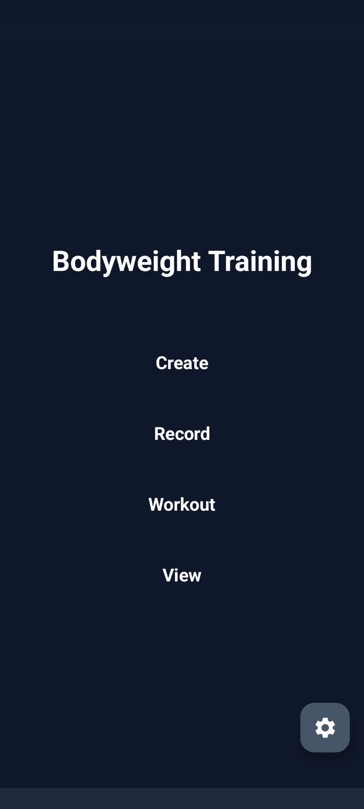
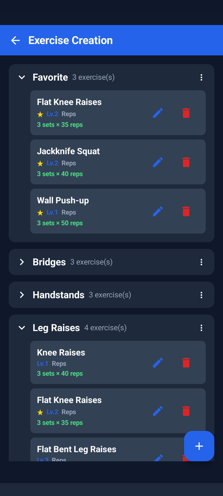
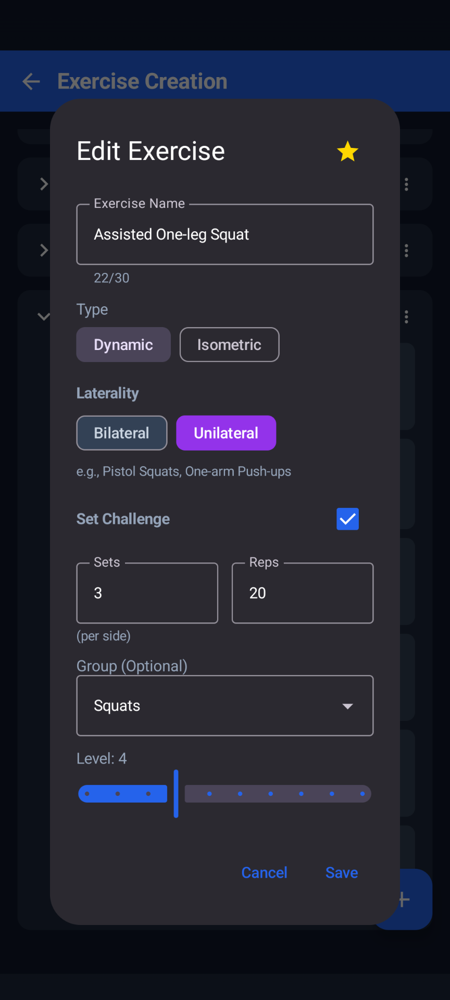
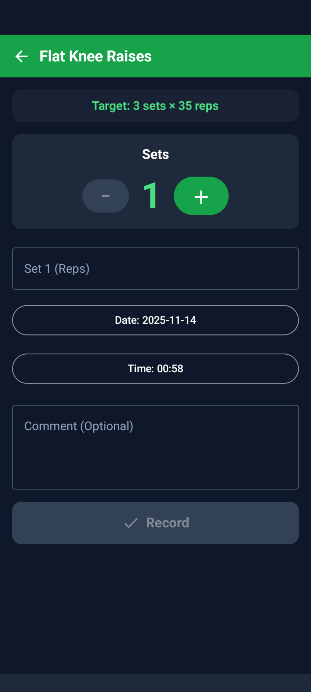
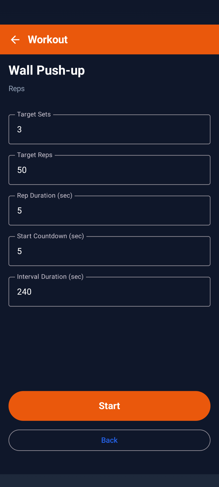
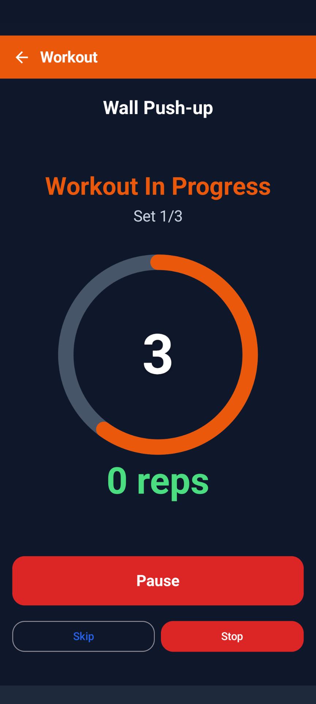
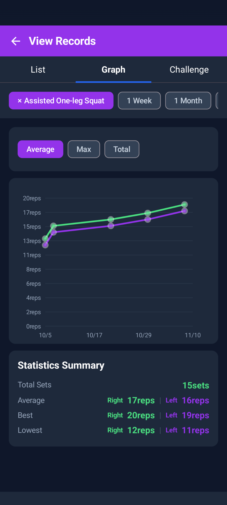
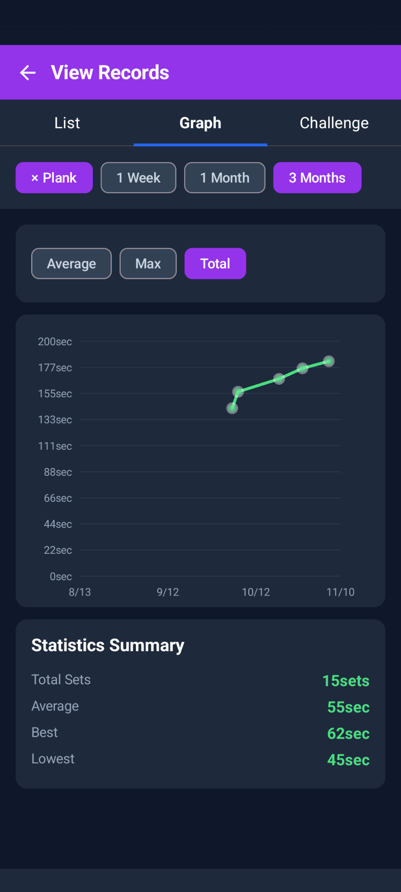

# Calisthenics Memory

[🇬🇧 English](README.md) | [🇯🇵 日本語](README.ja.md) | [🇪🇸 Español](README.es.md) | [🇩🇪 Deutsch](README.de.md) | [🇨🇳 简体中文](README.zh-CN.md) | [🇫🇷 Français](README.fr.md)

Eine einfache und anpassbare App zur Verfolgung von Eigengewichtstraining

---

## Über Diese App

Calisthenics Memory ist eine Android-App zum Aufzeichnen und Verwalten von Eigengewichtsübungen (Calisthenics) wie Liegestützen und Kniebeugen. Erstelle Übungen frei, organisiere sie in Gruppen und verfolge deinen Fortschritt auf deine Weise.

### Funktionen

- **Vollständig Anpassbar** - Erstelle Übungen frei, organisiere nach Gruppen, verwalte mit 10 Stufen, Favoritenregistrierung
- **Einfach** - Sorgfältig ausgewählte wesentliche Funktionen mit intuitiver Benutzeroberfläche
- **Zwei Modi** - Schneller Aufzeichnungsmodus und automatischer geführter Trainingsmodus mit Timer
- **Datenschutzorientiert** - Vollständig offline, Daten bleiben nur auf deinem Gerät

---

## Screenshots

### Startbildschirm
<p align="center">
  
</p>

Einfacher und intuitiver Startbildschirm. Schneller Zugriff auf 4 Hauptfunktionen.

---

### ⚙️ Übungsverwaltung

<p align="center">
  
  
</p>

**Links**: Favorisierte Übungen werden oben in einer eigenen Gruppe angezeigt. Leicht erkennbar mit ★-Markierungen.
**Rechts**: Bildschirm zum Erstellen/Bearbeiten von Übungen. Flexible Einstellungen für Typ (Wiederholungen/Zeit), Seitigkeit, Herausforderungen und Stufen.

- Organisiere hierarchisch nach Gruppen
- Verwalte progressiv mit Stufen (1-10)
- Schneller Zugriff auf häufig genutzte Übungen mit Favoriten

---

### 📝 Aufzeichnungsfunktion

<p align="center">
  
  
  
</p>

**Links**: Übungsauswahlbildschirm. Klar organisiert mit Favoriten und hierarchischen Gruppen.
**Mitte**: Beidseitige Übungen (normale Liegestütze, Kniebeugen usw.) werden einfach aufgezeichnet.
**Rechts**: Einseitige Übungen (Pistol Squats, einarmige Liegestütze usw.) werden separat für links und rechts aufgezeichnet.

- Frei einstellbare Anzahl von Sätzen
- Füge Datum, Uhrzeit und Kommentare hinzu
- Minimiere Aufzeichnungsaufwand mit schneller Eingabe

---

### 🏋️ Trainingsfunktion

<p align="center">
  
  
  
</p>

Automatischer geführter Trainingsmodus:

1. **Übung Auswählen** - Klar organisiert mit Favoriten und hierarchischer Anzeige
2. **Einstellungen Anpassen** - Stelle Zielsätze/Wiederholungen, Zeit pro Wiederholung, Countdown und Pausen ein
3. **Ausführen** - Automatischer Fortschritt vom Countdown zur Ausführung, Pausen

Verwalte dein Tempo einfach durch einen Blick auf den Bildschirm, um dich auf das Training zu konzentrieren. Überspringe oder stoppe zwischendurch und speichere Aufzeichnungen bis zu diesem Punkt.

---

### 📊 Ansichtsfunktion - Listentab

<p align="center">
  
  
</p>

**Links**: Überprüfe vergangene Trainingsaufzeichnungen chronologisch.
**Rechts**: Einseitige Übungen zeigen linke und rechte Werte farbcodiert an (grün=rechts, lila=links).

- Sitzungsdetails (Datum/Uhrzeit, Satzinhalt, Kommentare) auf einen Blick
- Tippe zum Bearbeiten, Löschen-Button zum Entfernen
- Filtern nach Zeitraum (1 Woche/1 Monat/3 Monate/gesamte Zeit)

---

### 📈 Ansichtsfunktion - Diagrammtab

<p align="center">
  
  
</p>

**Links**: Einseitige Übungen zeigen links und rechts als separate Linien (grün=rechts, lila=links).
**Rechts**: Isometrische Übungen (Plank usw.) werden ebenfalls grafisch dargestellt. Überprüfe die Gesamttrainingszeit mit Summenanzeige.

- Wechsle Statistiktyp (Durchschnitt/Maximum/Gesamt) für vielseitige Analyse
- Zeitraumfilter (1 Woche/1 Monat/3 Monate/gesamte Zeit)
- Statistikzusammenfassung zeigt Gesamtsätze, Durchschnitt, beste und niedrigste Werte

---

### 🎯 Ansichtsfunktion - Herausforderungstab

<p align="center">
  
  
</p>

Überprüfe visuell den Erreichungsstatus von Zielen. Fortschrittsbalken zeigen den Fortschritt auf einen Blick:

- **100% oder mehr**: Perfekt abgeschlossen (✓ Erfolgsmarkierung angezeigt)
- **75-99%**: Guter Zustand
- **50-74%**: Fast geschafft
- **0-49%**: Weiter so

Hierarchische Anzeige aller Gruppen einschließlich Favoriten. Filtere nach Übung, um dich auf spezifischen Trainingsfortschritt zu konzentrieren.

---

### ⚙️ Einstellungsbildschirm

<p align="center">
  
</p>

Datenverwaltungsfunktionen:

**Vollständige Sicherung (JSON)**
- Exportiere/importiere alle Daten (Übungen, Gruppen, Aufzeichnungen)
- Unterstützt Datenmigration beim Gerätewechsel
- ⚠️ Vorhandene Daten werden beim Import gelöscht

**Aufzeichnungen Hinzufügen (CSV)**
- Lade Vorlage für Massenhinzufügung von Aufzeichnungen herunter
- Praktisch für Migration von analogen Aufzeichnungen oder Notiz-Apps
- Zu vorhandenen Daten hinzugefügt (nicht gelöscht)

---

## Hauptfunktionen

### Trainingsaufzeichnungen
- Zeichne Datum, Uhrzeit, Sätze, Wiederholungen (oder Sekunden) auf
- Unterstützt beidseitige Übungen (Liegestütze usw.) und einseitige Übungen (Pistol Squats usw.)
- Kommentarfunktion für Notizen zu Form und Erkenntnissen

### Ansicht von Aufzeichnungen
Überprüfe Aufzeichnungen in 3 Tabs:

1. **Listentab** - Zeige vergangene Aufzeichnungen in einer Liste, Bearbeiten und Löschen möglich
2. **Diagrammtab** - Visualisiere Fortschritt nach Zeitraum mit Diagrammen (Durchschnitt/Maximum/Gesamt)
3. **Herausforderungstab** - Überprüfe Zielerreichungsstatus, bewertet in 4 Stufen

### Herausforderungseinstellungen
- Stelle Zielsätze × Zielwert ein (Beispiel: 3 Sätze × 50 Wiederholungen)
- Flexible Erreichungsbewertung durch Beurteilung mit Summe der obersten N Sätze
- Farbe des Fortschrittsbalkens ändert sich entsprechend der Erreichungsrate

### Gruppenverwaltung und Favoriten
- Gruppiere Übungen (z.B. Liegestütze, Kniebeugen, Klimmzüge usw.)
- Organisiere klar mit hierarchischer Anzeige
- Verwalte progressiven Fortschritt mit Stufen (1-10)
- Zeige häufig genutzte Übungen in einer eigenen Gruppe mit Favoritenregistrierung

### Sicherung
- Exportiere Daten im JSON-Format
- Unterstützt Datenmigration zu einem anderen Gerät oder Backup
- Importiere Aufzeichnungen im CSV-Format (praktisch für Migration von analogen Aufzeichnungen oder Notiz-Apps)

### Mehrsprachige Unterstützung
- Unterstützt Deutsch, Englisch, Japanisch, Spanisch, Chinesisch (vereinfacht) und Französisch
- Wechselt automatisch entsprechend der Gerätespracheinstellung

---

## Anleitung

### 1. Übungen Erstellen
Füge neue Übungen vom "Erstellen"-Bildschirm hinzu:

1. Gib Übungsnamen ein (Beispiel: "Wall Push-up")
2. Wähle Typ (Dynamisch: wiederholungsbasiert / Isometrisch: zeitbasiert)
3. Wähle Seitigkeit (Beidseitig: beide Seiten / Einseitig: eine Seite)
4. Wähle Gruppe (optional)
5. Stelle Stufe ein (1-10, optional)
6. Stelle Herausforderung ein (Zielsätze × Zielwert, optional)
7. Favoritenregistrierung mit ★-Markierung (optional)

### 2. Training Aufzeichnen
Füge Aufzeichnungen vom "Aufzeichnen"-Bildschirm hinzu:

1. Wähle Übung (aus Favoriten oder hierarchischer Anzeige)
2. Stelle Anzahl der Sätze ein
3. Gib Werte für jeden Satz ein
4. Füge Kommentar hinzu (optional)
5. Überprüfe Datum und Uhrzeit (ändere bei Bedarf)
6. Tippe "Aufzeichnen"

### 3. Trainingsmodus Verwenden
Automatisches geführtes Training vom "Training"-Bildschirm:

1. Wähle Übung
2. Stelle Zielsätze und Wiederholungen ein
3. Timer-Einstellungen (Zeit pro Wiederholung, Countdown, Pause)
4. Tippe "Starten"
5. Automatischer Countdown → Ausführung → Pause → nächster Satz
6. Speichere Aufzeichnung nach Abschluss

### 4. Aufzeichnungen Ansehen
Überprüfe vergangene Aufzeichnungen auf dem "Aufzeichnungen Ansehen"-Bildschirm:

- **Listentab**: Anzeige nach Sitzung, Bearbeiten und Löschen möglich
- **Diagrammtab**: Visualisiere Fortschritt mit Liniendiagrammen
- **Herausforderungstab**: Zeige Zielerreichungsstatus mit Fortschrittsbalken

Filtere nach Übung und Zeitraum.

### 5. Daten Sichern
Exportiere und importiere Daten vom "Einstellungen"-Bildschirm:

**Vollständige Sicherung (JSON)**
- **Export**: "Daten Exportieren" → Wähle Speicherort
- **Import**: "Daten Importieren" → Wähle JSON-Datei
  - ⚠️ Vorhandene Daten werden beim Import gelöscht

**Aufzeichnungen Hinzufügen (CSV)**
- **Vorlage Herunterladen**: Hole dir CSV-Vorlage für Aufzeichnungen mit "Eingabevorlage Exportieren"
- **Aufzeichnungen Importieren**: Füge Aufzeichnungen aus CSV-Datei mit "Aufzeichnungen Importieren" hinzu
  - Zu vorhandenen Daten hinzugefügt (nicht gelöscht)
  - Praktisch für Migration von analogen Aufzeichnungen oder Notiz-Apps

---

## Herausforderungsbeurteilungsmechanismus

### Grundregeln
Zielerreichung wird durch die **Summe der obersten N Sätze** beurteilt.

**Beispiel: Wenn das Ziel "2 Sätze × 20 Wiederholungen" ist**

**Abgeschlossenes Muster**:
- 20 Wdh. + 20 Wdh. + 5 Wdh. → Summe der obersten 2 = 40 Wdh. (100%)
- 25 Wdh. + 16 Wdh. + 10 Wdh. → Summe der obersten 2 = 41 Wdh. (102%)

**Nicht Abgeschlossenes Muster**:
- 15 Wdh. + 15 Wdh. + 15 Wdh. → Summe der obersten 2 = 30 Wdh. (75%)

### Für Einseitige Übungen
Berechne oberste N für links und rechts jeweils und bewerte nach Durchschnitt.

**Beispiel: Wenn das Ziel "2 Sätze × 20 Wiederholungen (pro Seite)" ist**

**Beide Seiten Abgeschlossen**:
- Rechts: 20 Wdh. + 20 Wdh. = 40 Wdh. (100%)
- Links: 19 Wdh. + 21 Wdh. = 40 Wdh. (100%)
- **Durchschnitt: 100%** → Abgeschlossen

**Nur Eine Seite Abgeschlossen**:
- Rechts: 20 Wdh. + 20 Wdh. = 40 Wdh. (100%)
- Links: 15 Wdh. + 15 Wdh. = 30 Wdh. (75%)
- **Durchschnitt: 87.5%** → Nicht Abgeschlossen

### Bewertungskriterien

Farbe des Fortschrittsbalkens ändert sich entsprechend der Erreichungsrate:
- **100% oder mehr**: Perfekt abgeschlossen (✓ Erfolgsmarkierung angezeigt)
- **75-99%**: Guter Zustand
- **50-74%**: Fast geschafft
- **0-49%**: Weiter so

---

## Bildschirmstruktur

### Startbildschirm
Greife auf jede Funktion über 4 Buttons zu:
- **Erstellen** - Verwalte Übungen und Gruppen
- **Aufzeichnen** - Gib Trainingsaufzeichnungen ein
- **Training** - Automatisches geführtes Training
- **Ansehen** - Überprüfe vergangene Aufzeichnungen

Greife auf den Einstellungsbildschirm über den ⚙️-Button unten rechts zu.

### Übungsverwaltungsbildschirm (Erstellen)
Verwalte Übungen und Gruppen, stelle Herausforderungen ein. Favorisierte Übungen werden mit ★-Markierungen angezeigt und in einer eigenen Gruppe platziert.

### Aufzeichnungsbildschirm (Aufzeichnen)
Wähle Übung → Gib Sätze und Werte ein → Zeichne auf

### Trainingsbildschirm (Training)
Wähle Übung → Einstellungen → Vorbereitung → Ausführung → Pause → Abschluss → Aufzeichnen

### Ansichtsbildschirm (Aufzeichnungen Ansehen)
Überprüfe Aufzeichnungen in 3 Tabs: Liste / Diagramm / Herausforderung

---

## Tipps

### Effektive Nutzung
- **Nutze Favoriten**: Registriere häufig genutzte Übungen für schnelleren Zugriff
- **Nutze Stufen**: Verwalte progressiven Fortschritt mit Stufen 1-10
- **Stelle Herausforderungen Ein**: Klare Ziele sind effektiv zur Aufrechterhaltung der Motivation
- **Kommentarfunktion**: Notiere Erkenntnisse zu Form und körperlichem Zustand
- **Regelmäßige Sicherungen**: Exportiere und speichere Daten

### Wie Man Diagramme Liest
- **Durchschnitt**: Überprüfe Trainingsstabilität
- **Maximum**: Überprüfe Fortschritt der persönlichen Bestleistung
- **Gesamt**: Überprüfe Trainingsvolumen
- Einseitige Übungen zeigen links und rechts als separate Linien (grün=rechts, lila=links)

---

## Systemanforderungen

- **Unterstütztes OS**: Android 8.0 (API 26) oder höher
- **Speicher**: Ungefähr 10MB
- **Internet**: Nicht erforderlich (vollständig offline)

---

## Lizenz

Diese App wird unter der GNU General Public License v3.0 veröffentlicht. Siehe [LICENSE](LICENSE)-Datei für Details.

---

## Installation

### 📥 APK-Download

Die neueste Version kann von [Releases](https://github.com/Gonbei774/CalisthenicsMemory/releases) heruntergeladen werden.

**[📦 Download v1.2.0](https://github.com/Gonbei774/CalisthenicsMemory/releases/download/v1.2.0/app-release.apk)**

Falls du eine frühere Version benötigst, kannst du diese von der [Releases](https://github.com/Gonbei774/CalisthenicsMemory/releases)-Seite herunterladen.

### ⚠️ Haftungsausschluss

Diese App wird ohne Gewährleistung bereitgestellt. Unter der GPL-3.0-Lizenz auf "WIE BESEHEN"-Basis verteilt, ohne Gewährleistung der Marktgängigkeit oder Eignung für einen bestimmten Zweck. Wir sind nicht verantwortlich für Schäden, die aus der Nutzung entstehen.

### Installationsschritte

1. Lade APK-Datei vom obigen Link herunter
2. Tippe auf die heruntergeladene Datei
3. Erlaube "Installation aus unbekannten Quellen", falls aufgefordert
4. Installation abgeschlossen

### Sicherheitsüberprüfung

Falls du überprüfen möchtest, dass das APK nicht manipuliert wurde, überprüfe die SHA256-Prüfsumme:

```bash
# Berechne SHA256 des heruntergeladenen APK
sha256sum app-release.apk

# Vergleiche mit offiziellem SHA256
# https://github.com/Gonbei774/CalisthenicsMemory/releases/download/v1.2.0/app-release.apk.sha256
```

---

## FAQ

### F: Welche Trainingsmethoden werden unterstützt?
A: Jede Eigengewichtstrainingsmethode wird unterstützt, einschließlich Convict Conditioning, StartBodyweight oder eigene Programme. Du kannst Übungen frei erstellen, sodass du sie entsprechend deiner Trainingsphilosophie nutzen kannst.

### F: Wo werden Daten gespeichert?
A: Sie werden in einer lokalen Datenbank (SQLite) innerhalb der App gespeichert. Sie werden niemals ins Internet gesendet und funktionieren vollständig offline.

### F: Werden Sicherungen automatisch erstellt?
A: Nein, du musst manuell exportieren. Wir empfehlen regelmäßige Sicherungen.

### F: Werden Daten gelöscht, wenn ich die App deinstalliere?
A: Ja, sie werden gelöscht. Stelle sicher, dass du vor der Deinstallation exportierst.

### F: Kann ich sie ohne Herausforderungseinstellungen verwenden?
A: Ja, die Aufzeichnungsfunktion kann ohne Herausforderungseinstellungen verwendet werden. Sie wird nicht im Herausforderungstab angezeigt, aber Liste und Diagramme funktionieren einwandfrei.

### F: Wird mehrsprachig unterstützt?
A: Deutsch, Englisch, Japanisch, Spanisch, Chinesisch (vereinfacht) und Französisch werden unterstützt. Wechselt automatisch entsprechend der Gerätespracheinstellung.

### F: Wo werden favorisierte Übungen angezeigt?
A: Favorisierte Übungen werden automatisch in der "Favoriten"-Gruppe angezeigt. Sie werden weiterhin in ihrer ursprünglichen Gruppe angezeigt, sodass du von beiden zugreifen kannst.

---

## Entwicklung

### Build-Anweisungen

```bash
git clone https://github.com/Gonbei774/CalisthenicsMemory.git
cd CalisthenicsMemory
./gradlew assembleDebug
```

### Anforderungen
- JDK 17 oder höher
- Android SDK (API 26 oder höher)
- Gradle (im Projekt enthalten)

---

**Zuletzt Aktualisiert**: 10. November 2025