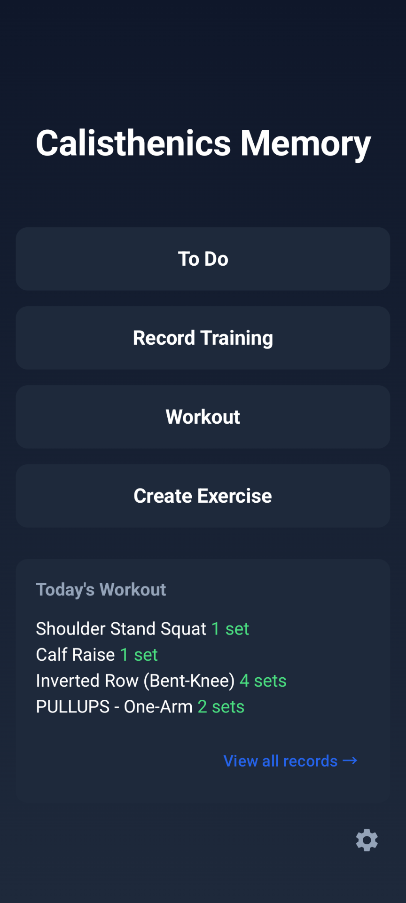
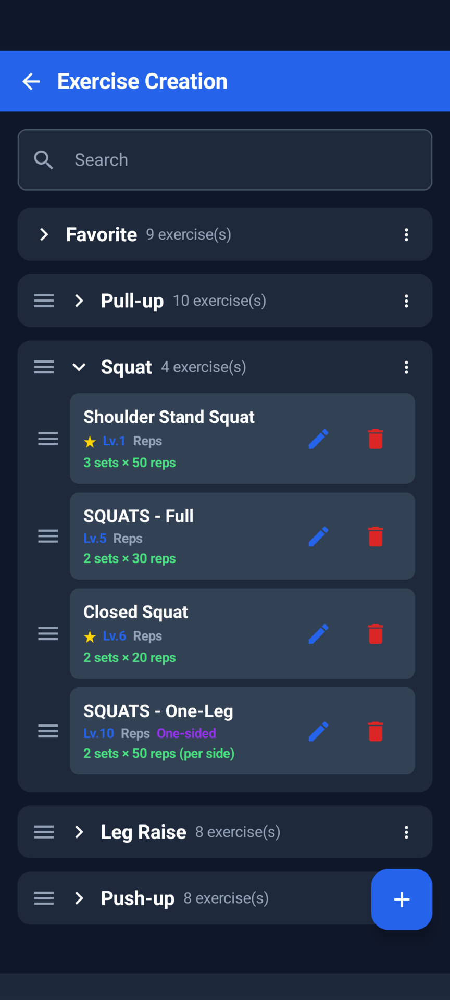
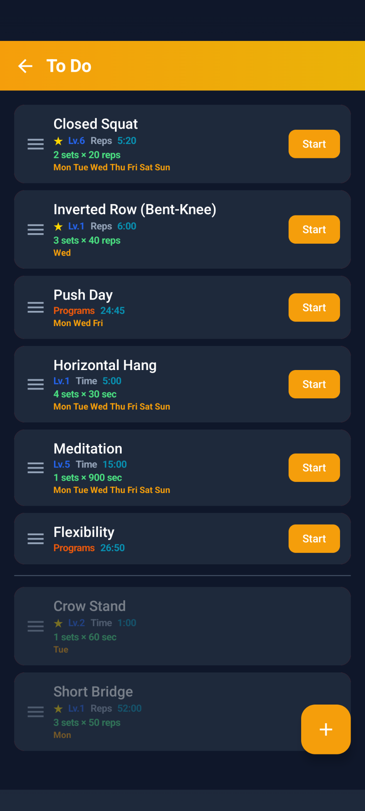
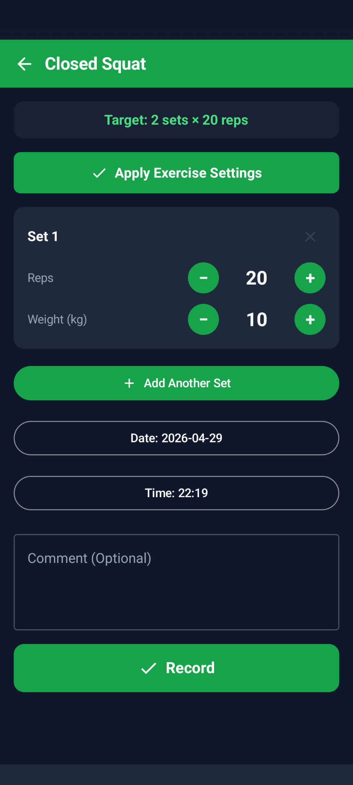
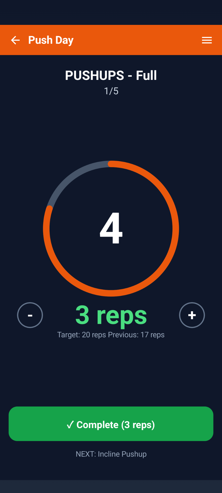
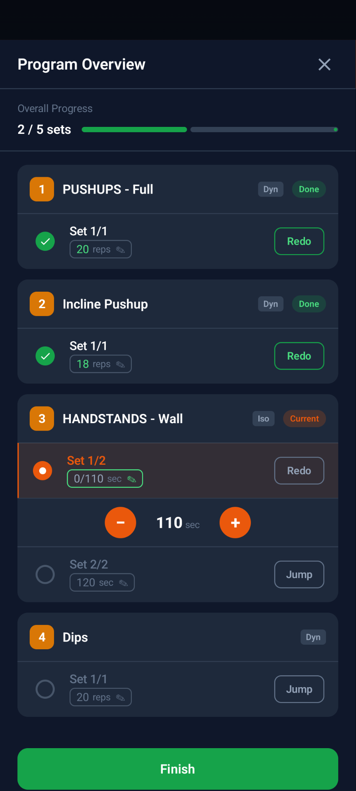

<table><tr>
  <td></td>
  <td>
    <h1>Calisthenics Memory &nbsp;|&nbsp; <a href="https://codeberg.org/Gonbei774/CalisthenicsMemory/src/branch/master/docs/readme/README.ja.md">日本語</a></h1>
    <p>
      
      
      <a href="https://shields.rbtlog.dev/io.github.gonbei774.calisthenicsmemory"></a>
    </p>
  </td>
</tr></table>

## About

A privacy-focused bodyweight training tracker. Customize everything to your liking.

## Features

- **To Do** - Plan your workout, tap to jump directly, schedule repeats by day of week
- **Record Mode** - Quick manual input
- **Workout Mode** - Auto-guided with timer, set completion notification
  - Single - Focus on one exercise
  - Program - Create and run multi-exercise routines, flexible navigation
  - Interval - Timed work/rest cycles with customizable rounds
- **Exercise Creation** - Configure dynamic/isometric, unilateral/bilateral, intervals and more
- **Progress Tracking** - Calendar, lists, graphs, challenge status
- **Data Management** - Export/import in JSON/CSV

## Screenshots

<p align="center">
  
  
  
</p>
<p align="center">
  
  
  
</p>

## Official Distribution

This app is officially distributed only through F-Droid, IzzyOnDroid, and Codeberg Releases.
We cannot guarantee the safety of APKs downloaded from any other source.

<p align="center">
  <a href="https://apt.izzysoft.de/fdroid/index/apk/io.github.gonbei774.calisthenicsmemory"></a>
</p>

<p align="center">
  <a href="https://f-droid.org/packages/io.github.gonbei774.calisthenicsmemory/"></a>
</p>

<p align="center">
  <a href="https://codeberg.org/Gonbei774/CalisthenicsMemory/releases"></a>
</p>

### Verify Signature

APK signing fingerprint (SHA-256):

```
18c00c347ea1001afcdd87258881d24d684047bbeb22c47fbe7b51499516ab54
```

How to verify:

```bash
apksigner verify --print-certs app-release.apk
```

### Verify Checksum

SHA256 checksum: See `app-release.apk.sha256` on the release page.

```bash
sha256sum -c app-release.apk.sha256
```

## Permissions

- `FOREGROUND_SERVICE`, `FOREGROUND_SERVICE_SPECIAL_USE`, `WAKE_LOCK` - Run timer in background
- `FLASHLIGHT` - Flash notification for rest intervals

See [IzzyOnDroid Permissions](https://android.izzysoft.de/applists/perms) for details.

## Contributing

See [CONTRIBUTING.md](CONTRIBUTING.md) for guidelines.

## Wiki

- [Getting Started](https://codeberg.org/Gonbei774/CalisthenicsMemory/wiki/Getting-Started)

## License

This project is licensed under the GNU General Public License v3.0. See [LICENSE](LICENSE) for details.

---

**Last Updated**: March 2, 2026