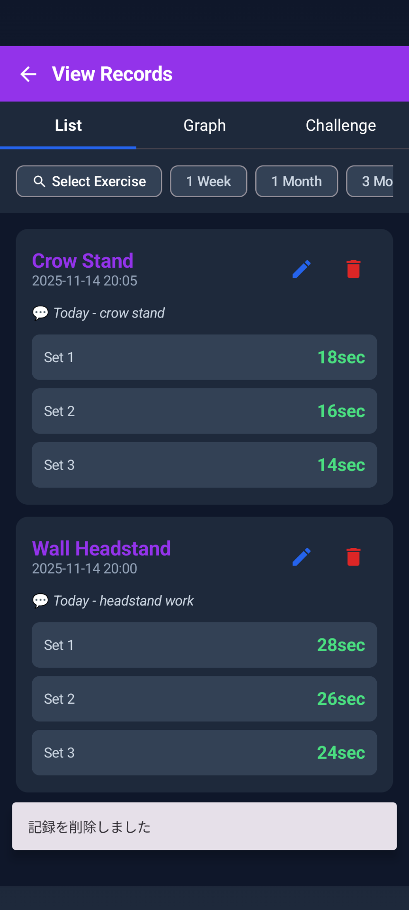

# Calisthenics Memory

[🇬🇧 English](../../README.md) | [🇯🇵 日本語](README.ja.md) | [🇪🇸 Español](README.es.md) | [🇩🇪 Deutsch](README.de.md) | [🇨🇳 简体中文](README.zh-CN.md) | [🇫🇷 Français](README.fr.md)

シンプルで自由にカスタマイズできる自重トレーニング記録アプリ

---

## このアプリについて

Calisthenics Memoryは、プッシュアップやスクワットなどの自重トレーニング（カリステニクス）を記録・管理するためのAndroidアプリです。種目を自由に作成し、グループで整理し、あなたのやり方で進捗を記録できます。

### 特徴

- **自由にカスタマイズ** - 種目を自由に作成、グループで整理、10段階のレベル管理、お気に入り登録
- **シンプル** - 必要な機能だけを厳選、直感的なUI
- **2つのモード** - スピーディーな記録モードと、タイマー付き自動ガイドのワークアウトモード
- **プライバシー重視** - 完全オフライン動作、データは端末内のみ

---

## スクリーンショット

### ホーム画面
<p align="center">
  
</p>

シンプルで直感的なホーム画面。4つの主要機能へすぐにアクセスできます。

---

### ⚙️ 種目管理

<p align="center">
  
  
</p>

**左**: お気に入り登録した種目は専用グループで先頭表示。★マークで一目で分かる
**右**: 種目作成・編集画面。タイプ（回数/時間）、左右、課題、レベルを柔軟に設定

- グループで階層的に整理
- レベル（1〜10）で段階的に管理
- お気に入り登録でよく使う種目を素早くアクセス

---

### 📝 記録機能

<p align="center">
  
  
  
</p>

**左**: 種目選択画面。お気に入りや階層グループで見やすく整理
**中央**: 両側種目（通常のプッシュアップ、スクワットなど）はシンプルに記録
**右**: 片側種目（ピストルスクワット、ワンアームプッシュアップなど）は左右別々に記録

- セット数を自由に調整可能
- 日付・時刻・コメントも追加可能
- スピーディーな入力で記録の手間を最小化

---

### 🏋️ ワークアウト機能

<p align="center">
  
  
  
  
</p>

自動ガイド付きのワークアウトモード：

1. **種目を選択** - お気に入りや階層表示で見やすく整理
2. **設定を調整** - 目標セット数・回数、1レップの時間、カウントダウン、インターバルを設定
3. **実行** - カウントダウンから実行、インターバルまで自動で進行
4. **完了** - サマリーを確認して記録を保存

トレーニングに集中できるよう、画面を見るだけでペースを管理できます。途中でスキップや中断も可能で、その時点までの記録を保存できます。

---

### 📊 閲覧機能 - 一覧タブ

<p align="center">
  
  
</p>

**左**: 過去のトレーニング記録を時系列で確認
**右**: 片側種目は左右の値を色分けして表示（緑=右、紫=左）

- 各セッションの詳細（日時・セット内容・コメント）が一目で分かる
- タップで編集、削除ボタンで削除可能
- 期間フィルター（1週間/1ヶ月/3ヶ月/全期間）で絞り込み

---

### 📈 閲覧機能 - グラフタブ

<p align="center">
  
  
</p>

**左**: 片側種目は左右を別々のライン（緑=右、紫=左）で表示
**右**: 時間制種目（Plank など）も同様にグラフ化。合計値表示で総トレーニング時間を確認

- 統計タイプ切り替え（平均/最大/合計）で多角的に分析
- 期間フィルター（1週間/1ヶ月/3ヶ月/全期間）
- 統計サマリーで総セット数、平均、ベスト、最低値を表示

---

### 🎯 閲覧機能 - 課題タブ

<p align="center">
  
  
</p>

目標達成状況を視覚的に確認。プログレスバーで進捗が一目瞭然：

- **100%以上**: 完璧にクリア（✓達成マーク表示）
- **75〜99%**: 良好な状態
- **50〜74%**: もう少し
- **0〜49%**: 頑張ろう

お気に入りグループを含む全グループを階層表示。種目別にフィルターして、特定のトレーニングの進捗を集中的にチェックできます。

---

### ⚙️ 設定画面

<p align="center">
  
  
</p>

データ管理とアプリ設定：

**言語選択**
- 設定から直接アプリの言語を変更可能
- 対応言語：日本語、英語、スペイン語、ドイツ語、中国語（簡体字）、フランス語
- 設定画面（左）と言語選択ダイアログ（右）

**完全バックアップ（JSON）**
- すべてのデータ（種目、グループ、記録）をエクスポート・インポート
- 端末変更時のデータ移行に対応
- ⚠️ インポート時は既存データを削除

**記録の追加（CSV）**
- テンプレートをダウンロードして記録を一括追加
- アナログ記録やメモアプリからの移行に便利
- 既存データに追加（削除されません）

---

## 主な機能

### トレーニング記録
- 日付・時刻・セット数・回数（または秒数）を記録
- 両側種目（プッシュアップなど）と片側種目（ピストルスクワットなど）に対応
- コメント機能で気づきやフォームのメモを記録

### 記録の閲覧
3つのタブで記録を確認できます：

1. **一覧タブ** - 過去の記録を一覧表示、編集・削除も可能
2. **グラフタブ** - 期間別にグラフで進捗を可視化（平均/最大/合計）
3. **課題タブ** - 目標の達成状況を確認、4段階で評価

### 課題設定
- 目標セット数×目標値を設定（例：3セット × 50回）
- 上位N個のセットの合計で判定するため、柔軟な達成評価が可能
- 達成率に応じてプログレスバーの色が変化

### グループ管理とお気に入り
- 種目をグループ分け（例：Push-ups、Squats、Pull-ups など）
- 階層表示で見やすく整理
- レベル（1〜10）で段階的な進捗を管理
- お気に入り登録でよく使う種目を専用グループに表示

### バックアップ
- JSON形式でデータをエクスポート
- 別の端末へのデータ移行やバックアップに対応
- CSV形式で記録をインポート（アナログ記録やメモアプリからの移行に便利）

### 多言語対応
- 日本語・英語・スペイン語・ドイツ語・中国語（簡体字）・フランス語に対応
- 設定画面からアプリ内で言語を選択可能
- デバイスの言語設定に応じた自動切り替えにも対応

---

## 使い方

### 1. 種目を作成する
「Create」画面から新しい種目を追加します：

1. 種目名を入力（例：「Wall Push-up」）
2. タイプを選択（Dynamic: 回数制 / Isometric: 時間制）
3. Lateralityを選択（Bilateral: 両側 / Unilateral: 片側）
4. グループを選択（任意）
5. レベルを設定（1〜10、任意）
6. 課題を設定（目標セット数 × 目標値、任意）
7. ★マークでお気に入り登録（任意）

### 2. トレーニングを記録する
「Record」画面から記録を追加します：

1. 種目を選択（お気に入りや階層表示から）
2. セット数を設定
3. 各セットの値を入力
4. コメントを追加（任意）
5. 日付・時刻を確認（必要に応じて変更）
6. 「Record」をタップ

### 3. ワークアウトモードを使う
「Workout」画面から自動ガイド付きのトレーニングができます：

1. 種目を選択
2. 目標セット数・回数を設定
3. タイマー設定（1レップの時間、カウントダウン、インターバル）
4. 「Start」をタップ
5. 自動でカウントダウン → 実行 → インターバル → 次のセット
6. 完了後、記録を保存

### 4. 記録を閲覧する
「View Records」画面で過去の記録を確認します：

- **List タブ**: セッション単位で表示、編集・削除可能
- **Graph タブ**: 折れ線グラフで進捗を可視化
- **Challenge タブ**: 目標の達成状況をプログレスバーで表示

フィルター機能で種目・期間を絞り込めます。

### 5. データをバックアップする
「Settings」画面からデータをエクスポート・インポートできます：

**完全バックアップ（JSON）**
- **エクスポート**: 「Export Data」→ 保存先を選択
- **インポート**: 「Import Data」→ JSONファイルを選択
  - ⚠️ インポートすると既存データは削除されます

**記録の追加（CSV）**
- **テンプレートをダウンロード**: 「Export Input Template」で記録用CSVテンプレートを取得
- **記録をインポート**: 「Import Records」でCSVファイルから記録を追加
  - 既存データに追加されます（削除されません）
  - アナログ記録やメモアプリからの移行に便利

---

## 課題判定の仕組み

### 基本ルール
目標を達成したかどうかは、**上位N個のセットの合計**で判定します。

**例：目標が「2セット × 20回」の場合**

**クリアパターン**:
- 20回 + 20回 + 5回 → 上位2個の合計 = 40回（100%）
- 25回 + 16回 + 10回 → 上位2個の合計 = 41回（102%）

**未クリアパターン**:
- 15回 + 15回 + 15回 → 上位2個の合計 = 30回（75%）

### 片側種目の場合
左右それぞれで上位N個を計算し、平均で評価します。

**例：目標が「2セット × 20回（片方あたり）」の場合**

**両側クリア**:
- 右: 20回 + 20回 = 40回（100%）
- 左: 19回 + 21回 = 40回（100%）
- **平均: 100%** → クリア

**片側のみクリア**:
- 右: 20回 + 20回 = 40回（100%）
- 左: 15回 + 15回 = 30回（75%）
- **平均: 87.5%** → 未クリア

### 評価基準

達成率に応じてプログレスバーの色が変わります：
- **100%以上**: 完璧にクリア（✓達成マーク表示）
- **75〜99%**: 良好な状態
- **50〜74%**: もう少し
- **0〜49%**: 頑張ろう

---

## 画面構成

### ホーム画面
4つのボタンから各機能にアクセスできます：
- **Create** - 種目・グループを管理
- **Record** - トレーニング記録を入力
- **Workout** - 自動ガイド付きトレーニング
- **View** - 過去の記録を確認

右下の⚙️ボタンから設定画面へアクセスできます。

### 種目管理画面（Create）
種目とグループを管理、課題を設定。お気に入り登録した種目は★マークで表示され、専用グループに配置されます。

### 記録画面（Record）
種目を選択 → セット数・値を入力 → 記録

### ワークアウト画面（Workout）
種目選択 → 設定 → 準備 → 実行 → インターバル → 完了 → 記録

### 閲覧画面（View Records）
一覧 / グラフ / 課題の3タブで記録を確認

---

## ヒント

### 効果的な使い方
- **お気に入り機能を活用**: よく使う種目を登録してアクセスを高速化
- **レベルを活用**: 1〜10のレベルで段階的な進捗を管理
- **課題を設定**: 明確な目標があるとモチベーション維持に効果的
- **コメント機能**: フォームの気づきや体調をメモ
- **定期的にバックアップ**: データをエクスポートして保存

### グラフの見方
- **平均**: トレーニングの安定性を確認
- **最大**: 自己ベストの推移を確認
- **合計**: トレーニングボリュームを確認
- 片側種目は左右別々にラインで表示されます（緑=右、紫=左）

---

## 動作環境

- **対応OS**: Android 8.0（API 26）以上
- **ストレージ**: 約10MB
- **インターネット**: 不要（完全オフライン動作）

---

## ライセンス

このアプリはGNU General Public License v3.0の下で公開されています。詳細は[LICENSE](LICENSE)ファイルをご覧ください。

---

## インストール

### 📥 APKダウンロード

最新版は[Releases](https://github.com/Gonbei774/CalisthenicsMemory/releases)からダウンロードできます。

**[📦 v1.3.0をダウンロード](https://github.com/Gonbei774/CalisthenicsMemory/releases/download/v1.3.0/app-release.apk)**

過去のバージョンが必要な場合は[Releases](https://github.com/Gonbei774/CalisthenicsMemory/releases)ページからダウンロードできます。

### ⚠️ 免責事項

このアプリは無保証で提供されます。GPL-3.0ライセンスの下、現状有姿（AS IS）で配布されており、商品性や特定目的適合性について一切保証しません。使用に起因するいかなる損害についても責任を負いかねます。

### インストール手順

1. 上記リンクからAPKファイルをダウンロード
2. ダウンロードしたファイルをタップ
3. 「提供元不明のアプリ」の許可を求められた場合は許可
4. インストール完了

### セキュリティ確認

APKの改ざんがないか確認したい場合は、SHA256チェックサムを検証してください：

```bash
# ダウンロードしたAPKのSHA256を計算
sha256sum app-release.apk

# 公式のSHA256と比較
# https://github.com/Gonbei774/CalisthenicsMemory/releases/download/v1.3.0/app-release.apk.sha256
```

---

## よくある質問

### Q: どんなトレーニング方法に対応していますか？
A: Convict Conditioning、StartBodyweight、または独自のプログラムなど、あらゆる自重トレーニング方法に対応しています。種目を自由に作成できるため、あなたのトレーニング哲学に合わせて使えます。

### Q: データはどこに保存されますか？
A: アプリ内のローカルデータベース（SQLite）に保存されます。インターネットに送信されることはなく、完全にオフラインで動作します。

### Q: バックアップは自動で取られますか？
A: いいえ、手動でエクスポートする必要があります。定期的なバックアップをおすすめします。

### Q: アプリをアンインストールするとデータは消えますか？
A: はい、消えます。アンインストール前に必ずエクスポートしてください。

### Q: 課題を設定しなくても使えますか？
A: はい、記録機能は課題設定なしでも使えます。課題タブには表示されませんが、一覧・グラフは問題なく使えます。

### Q: 多言語対応していますか？
A: 日本語・英語・スペイン語・ドイツ語・中国語（簡体字）・フランス語に対応しています。設定画面から直接言語を変更できるほか、デバイスの言語設定に応じた自動切り替えにも対応しています。

### Q: お気に入り登録した種目はどこに表示されますか？
A: お気に入り登録した種目は「お気に入り」グループに自動で表示されます。元のグループにも引き続き表示されるため、どちらからもアクセス可能です。

---

## 開発

### ビルド方法

```bash
git clone https://github.com/Gonbei774/CalisthenicsMemory.git
cd CalisthenicsMemory
./gradlew assembleDebug
```

### 要件
- JDK 17以上
- Android SDK（API 26以上）
- Gradle（プロジェクトに含まれる）

---

**最終更新**: 2025年11月13日